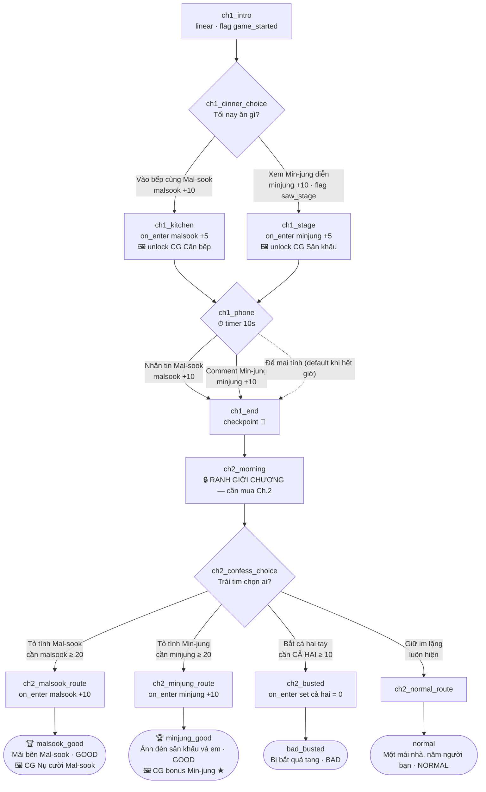

# Kịch bản demo — "Năm Trái Tim Dưới Một Mái Nhà"

Tài liệu cho biên kịch/QA: cốt truyện, đồ thị phân nhánh, luật affinity và
điều kiện mở từng ending của `demo-story.json`. Sửa kịch bản = sửa file JSON
(tham chiếu bằng `code`), xoá `backend/data/game.db`, chạy `go run ./cmd/seed`.

## Bối cảnh

Nhân vật chính (người chơi) sống chung một mái nhà với hai cô gái. Demo gồm
2 chương: Chương 1 (miễn phí) xây dựng thiện cảm, Chương 2 (trả phí $2.99)
là màn tỏ tình quyết định ending.

## Nhân vật

| Code | Tên | Archetype | Cách tăng affinity |
|---|---|---|---|
| `malsook` | Mal-sook | Bạn thanh mai trúc mã (childhood_friend) | Vào bếp, nhắn tin hỏi thăm |
| `minjung` | Min-jung | Idol | Xem biểu diễn, comment bài đăng |

Affinity 0–100, bắt đầu 0. Demo cần **≥ 20** để mở lựa chọn tỏ tình.

## Đồ thị truyện

## Bảng affinity theo đường đi (Chương 1)

| Lựa chọn bữa tối | Lựa chọn điện thoại | malsook | minjung | Mở được ở màn tỏ tình |
|---|---|---|---|---|
| Bếp (+10, +5) | Nhắn Mal-sook (+10) | **25** | 0 | Tỏ tình Mal-sook, Im lặng |
| Bếp (+10, +5) | Comment Min-jung (+10) | 15 | 10 | **Bắt cá hai tay**, Im lặng |
| Bếp (+10, +5) | Để mai tính | 15 | 0 | Im lặng (chỉ normal end) |
| Sân khấu (+10, +5) | Comment Min-jung (+10) | 0 | **25** | Tỏ tình Min-jung, Im lặng |
| Sân khấu (+10, +5) | Nhắn Mal-sook (+10) | 10 | 15 | **Bắt cá hai tay**, Im lặng |
| Sân khấu (+10, +5) | Để mai tính | 0 | 15 | Im lặng (chỉ normal end) |

> Lưu ý thiết kế: không đường nào đạt cả hai ≥ 20 trong demo — option "Bắt cá
> hai tay" (gate ≥ 10 cả hai) chỉ xuất hiện khi người chơi "chia tim" ở 2 màn
> chọn, và luôn dẫn tới BAD end. Đây là trap có chủ đích.

## Endings

| Code | Title | Rank | Điều kiện đường đi |
|---|---|---|---|
| `malsook_good` | Mãi bên Mal-sook | good | malsook ≥ 20 khi tỏ tình → route Mal-sook |
| `minjung_good` | Ánh đèn sân khấu và em | good | minjung ≥ 20 khi tỏ tình → route Min-jung |
| `normal` | Một mái nhà, năm người bạn | normal | Chọn "Giữ im lặng" (luôn khả dụng) |
| `bad_busted` | Bị bắt quả tang | bad | Chọn "Bắt cá hai tay" (cả hai ≥ 10) |

## Gallery (4 item)

| Item | Unlock khi tới scene | Ghi chú |
|---|---|---|
| CG: Căn bếp ấm áp | `ch1_kitchen` | nhánh bếp |
| CG: Sân khấu rực rỡ | `ch1_stage` | nhánh sân khấu |
| CG: Nụ cười Mal-sook | `end_malsook_good` | ending |
| CG: Min-jung sau cánh gà ★ | `end_minjung_good` | bonus |

Unlock là **vĩnh viễn** (bảng `user_unlocks`) — restart không mất. Muốn full
gallery phải chơi lại ≥ 2 lần (2 nhánh chương 1 + 2 ending good).

## Cơ chế đáng chú ý cho QA

- `ch1_phone` có **timer 10 giây**: hết giờ tự chọn "Để mai tính" (default) —
  đường này khoá cả 2 lựa chọn tỏ tình → chỉ còn normal end.
- `ch1_end` là **checkpoint** + ranh giới chương: advance tiếp sẽ trả
  402 `CHAPTER_LOCKED` nếu chưa mua Chương 2.
- `ch2_busted` dùng `set_affinity` đưa cả hai về 0 (minh hoạ effect gán tuyệt đối).
- Mỗi scene `choice` luôn có ≥ 1 lựa chọn không điều kiện ("Im lặng", "Để mai
  tính") → không bao giờ kẹt nhánh (chống lỗi kiểu "Meow ending").
- Test nhanh từng nhánh: sửa `entry` của chương trong JSON, re-seed, hoặc viết
  thêm scene jump (roadmap: chế độ skip/jump cho QA).

## Checklist khi thêm chương / nhánh mới

1. Mỗi scene `linear` có `next`; `choice` có ≥ 1 option luôn-khả-dụng; `ending` có record trong mảng `endings`.
2. Mọi gate affinity phải đạt được bằng ít nhất một đường đi (xem bảng affinity ở trên — cập nhật bảng khi đổi số).
3. Clip mới: thêm vào mảng `media` + bỏ file vào `backend/media/`.
4. Chạy `go run ./cmd/seed` — loader sẽ fail nếu ref sai, dead-end, hay DSL lỗi.
5. Chạy `go test ./...` — bổ sung integration test cho route mới trong `internal/director/director_test.go`.
